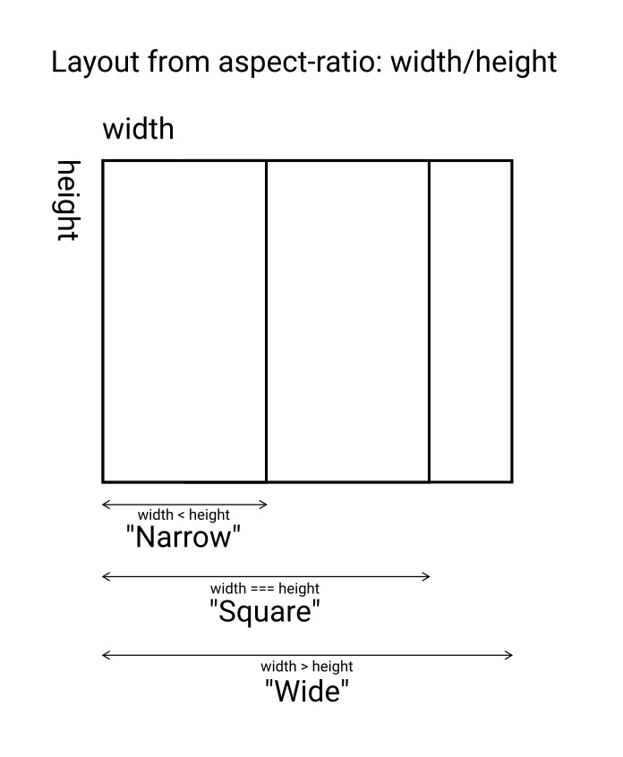
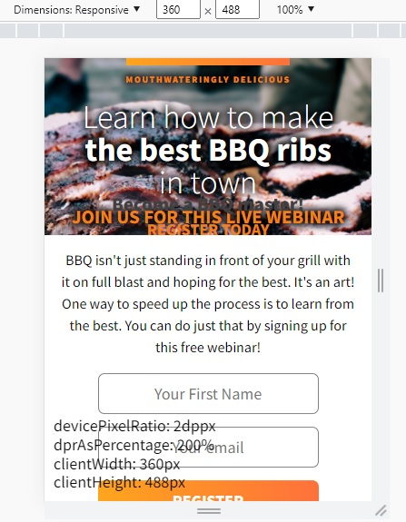

# aspect-ratio-bbq

HTML, CSS, JavaScript

Here I explore the concept of js media queries from aspect-ratio without external libraries.\
For instance:
```
if (width < height) ---> apply narrow layout
if aspect-ratio: 0.8 from width/height ---> apply narrow layout
if (width > height) ---> wide layout
```
(Will require tweaks for large displays anyway)\
It could be done with window.matchMedia() .match, but would be the same as with CSS.



### First iteration: as JavaScript
```
// global
const elemPageCB = document.querySelector(".page-container-box");
const elemHeroCB = document.querySelector(".hero-container-box");
const elemMessCB = document.querySelector(".message-container-box");
// etc produced

// "resize" is expensive, but helps with this situation
window.addEventListener("resize", () => {
  let dWidth = document.documentElement.clientWidth;
  let dHeight = document.documentElement.clientHeight;
  
  if (dWidth >= dHeight) {
    // apply wide layout
    elemPageCB.style.setProperty("flex-direction", "row");
    
    elemHeroCB.style.setProperty("width", "58.75%");
    elemHeroCB.style.setProperty("height", "100vh");
    
    elemMessCB.style.setProperty("width", "41.25%");
    elemMessCB.style.setProperty("height", "100vh");
    
    // etc, not refactored
  } else {
    // apply narrow layout
    
    elemPageCB.style.setProperty("flex-direction", "column");
    
    elemHeroCB.style.setProperty("width", "100%");
    elemHeroCB.style.setProperty("height", "40%");
    
    elemMessCB.style.setProperty("width", "100%");
    elemMessCB.style.setProperty("height", "60%");
    
    // etc, not refactored
  }
}
```

I expanded the js script to behave as layout media queries, but even with functions (factory) it got complex to maintain.\
The problem with these is the requirement of setting up each layout trigger with explicit properties,\
while with React, postCSS or plain CSS you can get away with it by specifying the scope where each rule gets applied.\
Also, js media queries have bigger priority (specificity).\
It can work, but without an engine that builds the rules it is cumbersome.\
Besides typical font sizes rules I am studying conditional device pixel ratio and image resolution.\

### Second iteration: as CSS
I will build it with plain CSS and get it work as it should, then re build it as js.\
Main issue with CSS @media (max-aspect-ratio: ratio), with aspect-ratio = width/heigth,\
to set that up you have to obtain the "ratio" from calculated relation width/height in integers.\
For example, to obtain a ratio of 0.8 y could be a width of 8 and a height of 10.\
You can reach the ratio (and trigger the media query) with a lower height, having narrow layouts on a wide display...\
I could solve it from the scope of widths, but is not the concept.

### About the layout itself
The base project is from Scrimba (Frontend Path).\
(Requires more work on small displays)\
I hosted it on: [https://stellar-kheer-7b0eee.netlify.app/](https://stellar-kheer-7b0eee.netlify.app/)\


## About the tooltip at the corner
Because the browser Dev Tools inspector (Chrome, Firefox) only shows pixel sizes,\
I added a simple script that detects the local inner window size and devicePixelRatio:\
[devicepixelratio.js](../main/devicepixelratio.js)
It is responsive to resizes, with dynamic text.\

Of course, the input form is not connected to anything.


