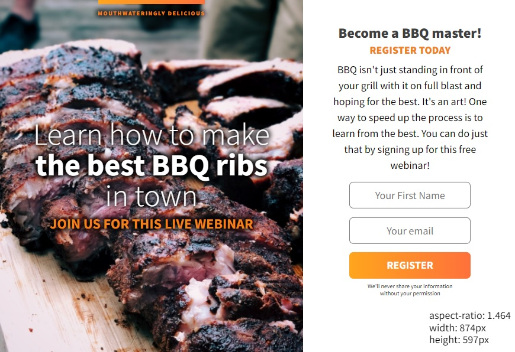

# aspect-ratio-bbq

It is a course project from Scrimba (Frontend Path).\
Currently the display sizes vary a lot between devices\
so the idea is to do media queries from aspect-ratio \
instead of a large description of all possible screen sizes.

Hosted on: [https://stellar-kheer-7b0eee.netlify.app/](https://stellar-kheer-7b0eee.netlify.app/)

Because the browser Dev Tools inspector (Chrome, Firefox) only shows pixel sizes,\
I added a simple script that detects the local inner window size:\
[script.js](../main/script.js)
(It is responsive to resizes, with dynamic text. Look down at the right-bottom corner.\

It is a work in progress for the aspect-ratio responsiveness,\
because it is a nice feature, with some quirks (read the script for notes).\
For instance it will load the narrow css when rendering on mobile,\
(at this moment the text is not resizing correctly, yet!)\
but if you do resizes from desktop wide to narrow, when passing the square 1/1 aspect-ratio\
it might keep the wide format to narrow. Needs work, but is better than using vh or percentages.

Of course, the input form is not connected to anything.

